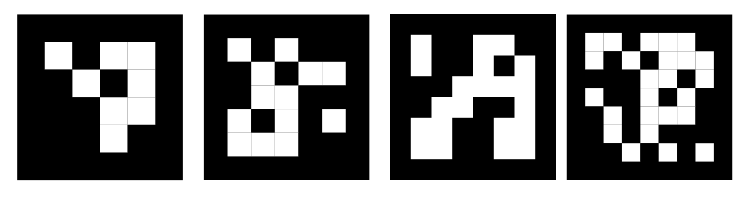

ArUco marker-based displacement measurement Python module
----------------------------------------------------

Perform displacement measurement using ArUco phisical markers captured with a still camera

Using this package
-----------------------

Download the repository

Simple examples
---------------

Here is a simple example on how to use the code:

.. code-block:: python

	import numpy as np
	import os
	from matplotlib.pyplot import show
	from pyArUco import *

	os.system('cls')

	path = file_explorer() # Path of the video to analyze
	video, fps = load_video(path) # Obtain matrix and frame rate information
	mrks_pos, sample_frame, id_detected = arUCO_video_detection(video, adv_param=True, binarization=True, thresh=120, dilate=True) # Detection parameters

	ID = 1 # Marker ID to look for in the analyzed video
        dim_mm = 15 # Marker phisical length [mm]

	relative_disp_mm, global_center_px, len_pixel = spatial_calibration(dim_mm,mrks_pos,ID) # Apply spatial calibration

	np.save('data_%i'%ID, relative_disp_mm) # Save numpy array of displacement

	plot_disp(relative_disp_mm, fps, ID)

	plt.show()
    

References:

Garrido-Jurado et al., Pattern Recognition 2016; Generation of fiducial marker dictionaries using Mixed Integer Linear Programming.

https://www.sciencedirect.com/science/article/pii/S0031320315003544

Tocci et al., IOP 2021; ArUco marker-based displacement measurement technique: uncertainty analysis.

https://iopscience.iop.org/article/10.1088/2631-8695/ac1fc7/meta
